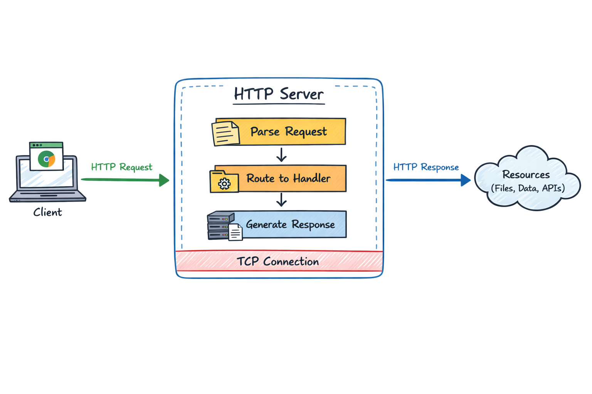

# HTTP/1.1 Server from Scratch



An HTTP/1.1 server implementation in Java, built from raw TCP sockets. No built-in HTTP libraries, no frameworks.

I wanted to understand how HTTP actually works, so I implemented the protocol from scratch. 
I learnt the whole technicality from this course [Learn the HTTP Protocol](https://www.boot.dev/lessons/b0cebf37-7151-48db-ad8a-0f9399f94c58) by ThePrimeAgen (please unblock me from X :( )

### Important
 - The course is in GoLang but I have written it in Java (because I work in it). 
 - I used ChatGPT as a socratic guide and helped me bridge the semantics between the languages.
 - I implemented the core concepts and logic myself and used ChatGPT to verify and corret me where I was wrong while teaching me as well in the process.

---

## What it does

A working HTTP/1.1 server that handles requests, serves responses, and supports some interesting features:

- Parses HTTP requests (request line, headers, body)
- Generates proper HTTP responses with status codes and headers
- Supports both fixed-length and chunked transfer encoding
- Acts as a streaming proxy (forwards requests to httpbin.org without buffering)
- Serves binary files like videos
- Calculates SHA-256 checksums and sends them as HTTP trailers

Everything runs on raw TCP sockets. Every byte of HTTP is implemented manually.

---

## Why build this?

Most of us use HTTP every day but never see how it actually works. Frameworks hide everything.

I had questions like:
- How does TCP data become an HTTP request?
- Why can't you just read everything at once?
- How does chunked encoding work?
- What are HTTP trailers?
- How do proxies stream data without loading it all into memory? 
- This Course was exactly what I wanted to learn it, and it helped a lot.
---

## Features

**Core HTTP:**
- Request parser (handles request line, headers, and body)
- Response writer with status codes and headers
- Fixed-length and chunked responses
- Case-insensitive header handling
- Binary-safe

**Advanced stuff:**
- Chunked transfer encoding (stream data without knowing size upfront)
- HTTP trailers (send metadata after the response body)
- Streaming proxy (forward requests without buffering)
- Binary content serving (video files, etc.)
- SHA-256 checksums in trailers

**Intentionally not implemented:**
- Keep-alive / persistent connections
- Range requests
- HTTPS / TLS
- HTTP/2 or HTTP/3
- Compression

I skipped these to keep the focus on core HTTP/1.1 mechanics.(The basics needed to be strong first!)

---

## Running it

**Requirements:**
- Java 21+
- Unix-like shell (macOS, Linux, or WSL)

**To run:**

```bash
./compile.sh
./run.sh
```

Server starts on **http://localhost:42069**

---

## Examples

**Basic response:**
```bash
curl http://localhost:42069/
```

**Error handling:**
```bash
curl http://localhost:42069/yourproblem   # 400 Bad Request
curl http://localhost:42069/myproblem     # 500 Internal Server Error
```

**Streaming proxy with chunked encoding:**
```bash
curl http://localhost:42069/httpbin/stream/10
```
This proxies to httpbin.org and streams back 10 JSON objects using chunked transfer-encoding. It also calculates an SHA-256 checksum and sends it as a trailer.

To see the raw HTTP response:
```bash
echo -e "GET /httpbin/stream/10 HTTP/1.1\r\nHost: localhost\r\n\r\n" | nc localhost 42069
```

**Video file:**
```bash
curl http://localhost:42069/video -o video.mp4
```

### Note: You can **also** hit these endpoints on any API testing tools like Postman, Insomnia, Bruno, etc.

---

## What you'll learn

If you dig into the code, you'll see:

- How HTTP messages are structured and transmitted over TCP
- Why you need to parse HTTP incrementally (can't just read everything at once)
- How chunked encoding works when you don't know the response size upfront
- What HTTP trailers are and how they work
- How proxies forward data without buffering it all in memory
- How HTTP handles both text and binary data

---

## Technical details

- Language: Java 21
- Concurrency: One thread per connection
- Transport: Raw TCP sockets (ServerSocket)
- Parsing: Incremental, stateful parser
- Dependencies: None (pure Java standard library)

---

## Background

This started as a way to really understand HTTP. I'd used it for years through frameworks but never knew what was actually happening on the wire.

Following this course I kept going and added streaming parsers, chunked transfer encoding, trailers, and a working proxy.

---

## Who this is for

If you've ever wondered "how does HTTP *really* work?", this is for you.

Useful for backend developers who want to see what happens below the framework level, students learning networking, or anyone curious about how the web works.

---

This is an educational project. Feel free to explore and learn from it.

#### Thanks to boot.dev and ThePrimeAgen for such a great educational resource for free!
